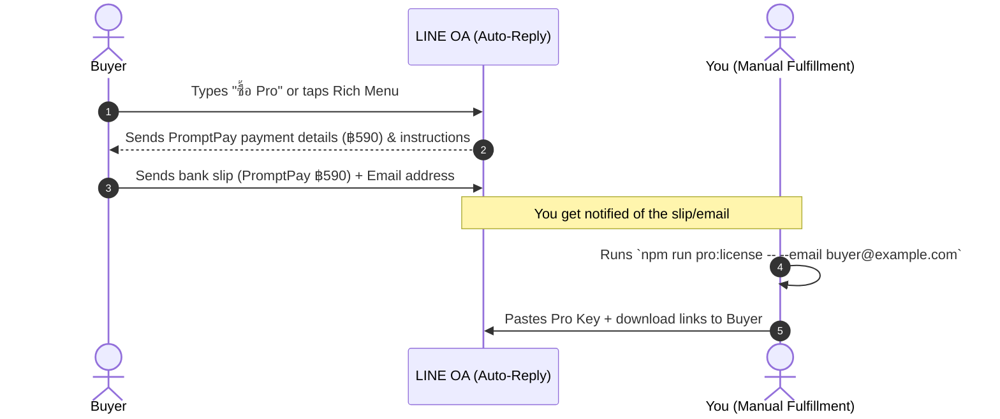

# LINE OA Auto-Reply Configuration Guide for BillNgai Pro

This guide outlines how to configure the **LINE Official Account (LINE OA)** Manager console (at [manager.line.biz](https://manager.line.biz)) for the **BillNgai Pro (Early Bird ฿590)** sales flow.

---

## 1. Flow Overview



---

## 2. Step 1: Configure Auto-response Message (ข้อความตอบกลับอัตโนมัติ)

Log in to the [LINE Official Account Manager](https://manager.line.biz) and set up a new keyword-based auto-response.

### Configuration settings:
* **Feature**: Auto-response messages (ข้อความตอบกลับอัตโนมัติ)
* **Title (ชื่อข้อความ)**: `BillNgai Pro Purchase Flow`
* **Status (สถานะ)**: `Scheduled / Active (เปิด)`
* **Keywords (คีย์เวิร์ด)**: Set exactly to (comma-separated or multiple):
  * `ซื้อ Pro`
  * `pro`
  * `Pro`
  * `สมัคร Pro`
  * `ชำระเงิน`
  * `ซื้อสิทธิ์ Pro`

### Message Content to Configure:
Set up **2 balloons** (messages) for the response:

#### Balloon 1: Text Message (Copy-Paste)
```text
สนใจสั่งซื้อสิทธิ์ BillNgai Pro (Early Bird) ครับ 🙏

ราคาพิเศษจ่ายครั้งเดียวใช้ได้ตลอดชีพ: ฿590 (จากราคาเต็ม ฿1,990)

📌 ฟีเจอร์ที่จะได้รับเพิ่มเติม:
• ระบบวิเคราะห์และอ่าน TOR ใบเสนอราคาอัตโนมัติด้วย AI
• ซิงก์ข้อมูลกับ Google Drive (ซิงก์ข้ามอุปกรณ์สะดวก)
• หมวดหมู่รายได้สำหรับยื่นภาษี (มาตรา 40)
• สิทธิ์อัปเดตแอปและใช้งานได้ตลอดชีพ

---

👇 วิธีการชำระเงินและรับรหัส:
1. สแกนจ่ายเงินยอด 590 บาท ผ่าน PromptPay QR (ด้านล่าง) หรือโอนมาที่:
   • เบอร์พร้อมเพย์: 062-728-3058
   • ชื่อบัญชี: วิศรุต สังขัม
2. โอนเงินเรียบร้อยแล้ว ส่ง "รูปสลิป" + "อีเมลของคุณ" เข้ามาในแชทนี้ได้เลยครับ!
```

#### Balloon 2: Image Message
Upload the **PromptPay 590 QR Code** image:
* Locate the image: `public/assets/brand/promptpay-590.svg` (or you can convert it to PNG/JPG for LINE OA uploads).
* File path reference: [promptpay-590.svg](file:///Users/visarutsankham/Documents/Personal-Project/promote-billiong/public/assets/brand/promptpay-590.svg)

---

## 3. Step 2: Configure Greeting Message (ข้อความทักทายเพื่อนใหม่)

To capture interest immediately when a user adds the LINE Official Account, update your **Greeting Message (ข้อความทักทายเพื่อนใหม่)**:

```text
ยินดีต้อนรับสู่ บิลง่าย (BillNgai) ครับ! 🎉
แอปพลิเคชันช่วยออกบิลและจัดการภาษีสำหรับฟรีแลนซ์ไทย

เบื้องต้นคุณสามารถดาวน์โหลดใช้งานเวอร์ชัน Local ฟรี (จำกัดเฉพาะการทำงานออฟไลน์) หรือสั่งซื้อสิทธิ์ Pro ได้ง่ายๆ ด้านล่างนี้ครับ

💬 พิมพ์คำว่า "ซื้อ Pro" หรือคลิกเมนูด้านล่างเพื่อดูรายละเอียดราคาพิเศษ ฿590 จ่ายครั้งเดียวจบ!

ดาวน์โหลดแอป:
• macOS DMG: https://pub-4ed16d146bff4f168839661507e1748a.r2.dev/BillNgai-2.0.0-universal.dmg
• Windows EXE: https://pub-4ed16d146bff4f168839661507e1748a.r2.dev/BillNgai%20Setup%202.0.0.exe
```

---

## 4. Step 3: Configure Rich Menu (ริชเมนู) for 1-Tap Purchase

Create a **Rich Menu** at the bottom of the chat screen so buyers can purchase instantly without typing.

### Rich Menu Image
Use the generated template image located in the repository (exactly 1040x1040 pixels):
* File: `line-oa-promos/rich-menu-square.png`
* File link: [rich-menu-square.png](file:///Users/visarutsankham/Documents/Personal-Project/promote-billiong/line-oa-promos/rich-menu-square.png)

### Layout & Action Configurations:
* **Template Layout**: Select the template with **1 tall vertical block on the right** and **2 horizontal blocks stacked on the left**.
* **Right Block (ซื้อ Pro ฿590 - Action A)**:
  * **Action**: Text (ข้อความ)
  * **Text to send**: `ซื้อ Pro` (this will automatically trigger the Auto-response message configured above).
* **Top-Left Block (ดาวน์โหลดแอป - Action B)**:
  * **Action**: Link (ลิงก์)
  * **URL**: `https://billiong.com` (or your Cloudflare Pages production URL).
* **Bottom-Left Block (คุยกับทีมงาน - Action C)**:
  * **Action**: Text (ข้อความ)
  * **Text to send**: `ติดต่อเจ้าหน้าที่` (allows them to wait for a manual human response).

---

## 5. Step 4: Per-Sale Manual Fulfillment Template

When a buyer sends their **slip + email**, follow this checklist:

1. **Verify the slip** (Amount: ฿590, check PromptPay ID / Bank App notifications).
2. **Generate their Pro Key** using the terminal in the app repository:
   ```bash
   # Go to the local-bill-apps folder and run:
   npm run pro:license -- --email <buyer-email>
   ```
3. **Copy the generated key** and reply to the buyer on LINE using this exact template (replace `<KEY>` and `<EMAIL>`):

```text
ขอบคุณที่สนับสนุน BillNgai Pro ครับ 🙏

นี่คือรหัส Pro ของคุณที่ผูกกับอีเมล <EMAIL> (คัดลอกทั้งบรรทัดด้านล่าง):

<KEY>

วิธีเปิดใช้งาน:
1. เปิด BillNgai → ตั้งค่า → พื้นที่ทำงาน
2. กด "ดูแพ็กเกจ Pro" → วางรหัส → เปิดใช้งานรหัส

ลิงก์ดาวน์โหลดตัวแอปและปลั๊กอินเสริม:
- ตัวแอป macOS: https://pub-4ed16d146bff4f168839661507e1748a.r2.dev/BillNgai-2.0.0-universal.dmg
- ตัวแอป Windows: https://pub-4ed16d146bff4f168839661507e1748a.r2.dev/BillNgai%20Setup%202.0.0.exe
- โมดูล AI (macOS, 1.9 GB — เปิดไฟล์ .pkg แล้วติดตั้งได้เลย):
  https://pub-4ed16d146bff4f168839661507e1748a.r2.dev/BillNgai-AI-AddOn-typhoon2-3b-instruct-1.0.0.pkg
- โมดูล AI (Windows, 1.9 GB — แตก zip แล้วดับเบิลคลิก install.cmd):
  https://pub-4ed16d146bff4f168839661507e1748a.r2.dev/BillNgai-AI-AddOn-typhoon2-3b-instruct-1.0.0-win.zip

* รหัสนี้สามารถใช้ได้ทุกเครื่องของคุณเอง (Offline-verified)
หากติดปัญหาการใช้งานข้อไหน ทักแชทนี้ได้ตลอด 24 ชม. ครับ!
```

4. **Log the sale** in your spreadsheet.
